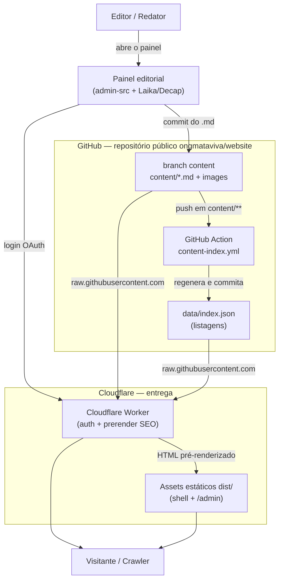
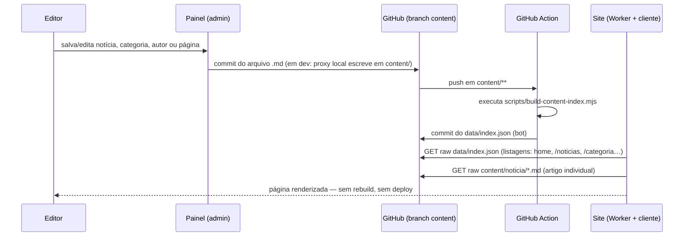
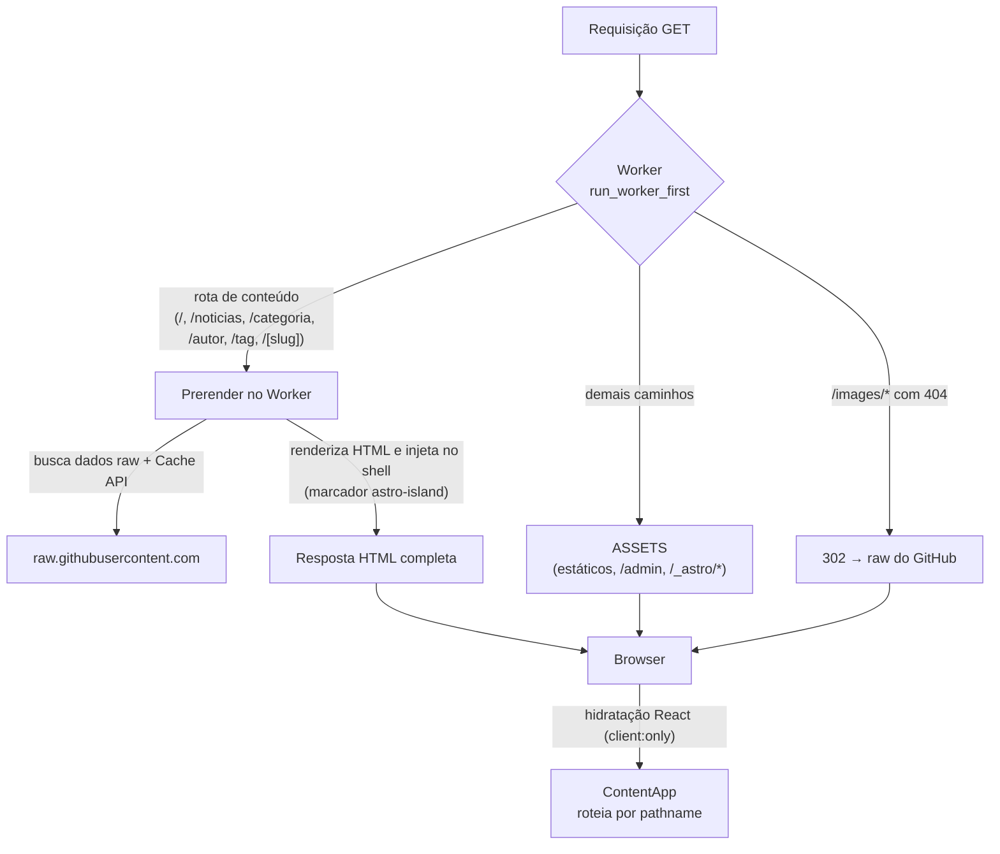
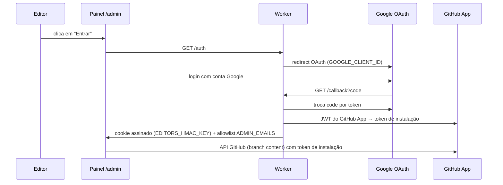
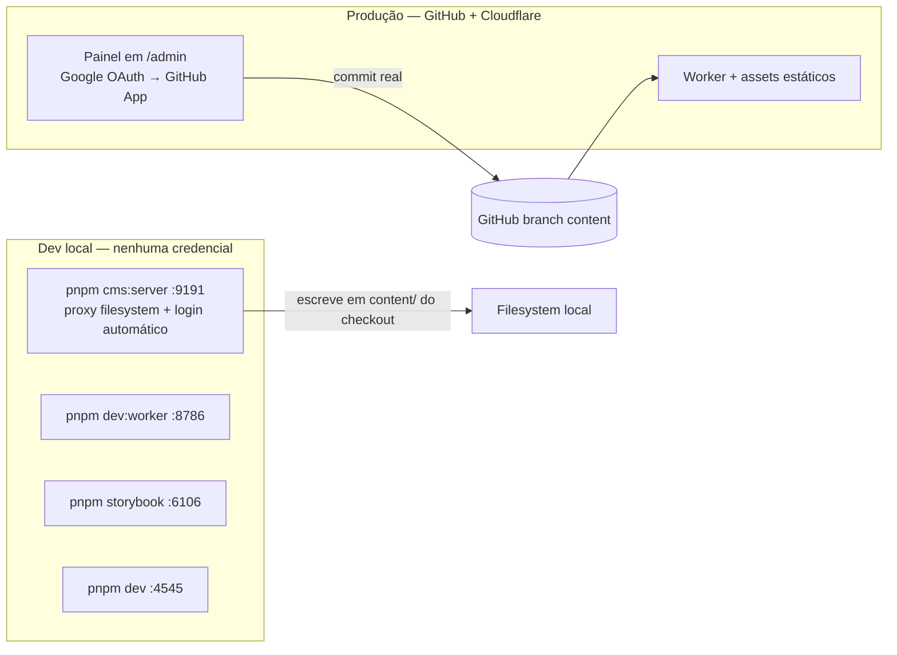

# Mata Viva — Arquitetura do Sistema

Este documento explica, com diagramas, **como o projeto Mata Viva se amarra para formar um sistema de gestão de conteúdo (CMS) aberto e gratuito** — sem servidor próprio, sem banco de dados e sem rebuild a cada publicação.

**Ideia central:** o conteúdo editorial vive como **markdown em um repositório público do GitHub**; o site é um esqueleto estático servido no free tier da Cloudflare que lê esses dados em runtime. Publicar = fazer um push de markdown.

> Detalhes de implementação (arquivos, comandos) estão no [`README.md`](../README.md) e no [`AMBIENTE-DESENVOLVIMENTO.md`](AMBIENTE-DESENVOLVIMENTO.md).

---

## 1. Visão de contexto

**Leitura do diagrama:** o editor só interage com o Painel. O Painel grava no GitHub (branch `content`); a Action deriva o índice; o Worker e os assets estáticos entregam o site lendo os dados via raw do GitHub. Não existe build intermediário entre a publicação e a leitura.

---

## 2. Fluxo de publicação do conteúdo

**Por que isso é gratuito:** o armazenamento é o GitHub público (free), a derivação de índice é uma GitHub Action de repo público (free) e a entrega é o free tier da Cloudflare. A publicação é só um commit — não consome build nem infraestrutura por notícia.

---

## 3. Entrega do site (renderização e prerender)

**Leitura do diagrama:** todas as requisições passam pelo Worker (`run_worker_first`). Nas rotas de conteúdo ele pré-renderiza o HTML no servidor (SEO) e injeta dentro do shell; o React, ao hidratar, substitui esse conteúdo sem duplicação. Se a rede falhar, o shell puro é servido (a página nunca quebra). O restante (assets, admin) cai no binding ASSETS.

---

## 4. Autenticação do admin

**Leitura do diagrama:** o login do painel é Google OAuth; o Worker emite um JWT do GitHub App para obter um token de instalação com permissão de escrita no branch `content`. A lista `ADMIN_EMAILS` é **fail-closed** — email fora da allowlist não entra. Em dev local isso é desnecessário: o proxy em `:9191` autentica sozinho e escreve direto no filesystem.

---

## 5. Dev local × produção

**A mesma base de código roda nos dois mundos:** a diferença é o *backend* — no local, um proxy sobre arquivos (sem rede externa); em produção, a API do GitHub com o token do App. Por isso é possível desenvolver o site inteiro sem precisar de nenhuma chave.

---

## 6. Por que é aberto e gratuito

| Camada | Componente | Custo |
|---|---|---|
| Armazenamento de conteúdo | Repositório público no GitHub (markdown + imagens) | Gratuito |
| Índice de listagens | GitHub Action `content-index.yml` em repo público | Gratuito |
| Servidor de borda | Cloudflare Worker (prerender + auth) — free tier | Gratuito |
| CDN dos arquivos | `raw.githubusercontent.com` | Gratuito |
| Painel editorial | Código próprio open-source (`admin-src/`) no mesmo repo | Gratuito |
| Servidor local de dev | Node (`server/index.mjs`) | Gratuito |

**Consequências de design:**

- **Sem lock-in de banco:** os dados são arquivos `.md` com frontmatter — portáveis, versionáveis e auditáveis com git.
- **Publicação leve:** não há pipeline de build por notícia; o custo de publicar é um commit.
- **Sem servidor próprio:** nenhuma máquina, banco ou VPS a manter — o site vive no free tier da Cloudflare.
- **Editor = git:** qualquer redator que use o painel está, por baixo, fazendo commit de markdown em um repositório público, com histórico completo e reversível.
